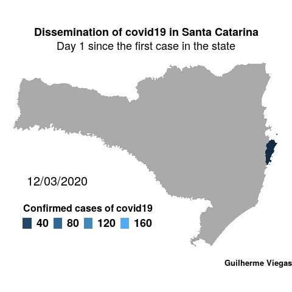

# **Article/Tutorial on building an animated map of the daily dissemination of covid19 in Santa Catarina.**

***

#### I’ve been following Data Science community and consuming its content for a long time now, learning a whole lot in the meanwhile, and finally got the chance to return all this knowledge I have absorbed. Today I bring you all a little animation on the dissemination of covid19 in my home state: Santa Catarina, Brazil.:brazil:

#### The goal is to plot an animated map which shows the dissemination of the coronavirus in the cities of Santa Catarina over the days since the beginning of the pandemy. In order to build this animated plot, we are gonna join shapefiles with the data of confirmed cases of covid19 in the state, plot the map and finally animate it. Working with spatial data in R is a challenge in itself. Plus, we are gonna animate it. So pay close attention cuz here we go!  :checkered_flag:

#### First of all, the package we are using to animate the plot is {[gganimate](https://cran.r-project.org/web/packages/gganimate/index.html)}, by Thomas Lin Pedersen and David Robinson. We are also using {[readr](https://cran.r-project.org/web/packages/readr/index.html)}, {[sp](https://cran.r-project.org/web/packages/sp/index.html)}, {[sf](https://cran.r-project.org/web/packages/sf/index.html)}, {[dplyr](https://cran.r-project.org/web/packages/dplyr/index.html)}, {[ggplot2](https://cran.r-project.org/web/packages/ggplot2/index.html)} and {[magick](https://cran.r-project.org/web/packages/magick/index.html)} in this script. :sparkler: :fireworks: :sparkler: :fireworks: :sparkler: :fireworks: :sparkler:

#### The shapefile of the state as whole and the shapefile of the cities are available on [IBGE](https://www.ibge.gov.br/) (Brazilian Institute of Geography and Statistics) and the covid confirmed cases data was pulled from [brasil.io](https://brasil.io/home/). The data and code are both in my github repository: <https://github.com/Gui-go/covid19_sc_animation>

#### In this tutorial we are gonna focus on the animation construction, omitting the data extraction and part of the transformation to get to the data table used for the animation. I like starting my R scripts by clearing the environment and collecting any garbage that might be sitting around.
```
# Cleaning up the environment before starting
rm(list = ls())
gc(verbose = T, full = T)
```
#### After that, we may load the packages needed. I suggest using the following code:
```
if(!require(PACKAGE)) install.packages("PACKAGE")
```
#### This way, R is gonna try loading the package. If it is not installed, R is gonna install it for us.
```
# Loading needed packages. If not installed, It is gonna install it automatically.
if(!require(readr)) install.packages("readr")
if(!require(sp)) install.packages("sp")
if(!require(sf)) install.packages("sf")
if(!require(dplyr)) install.packages("dplyr")
if(!require(ggplot2)) install.packages("ggplot2")
if(!require(gganimate)) install.packages("gganimate")
if(!require(magick)) install.packages("magick")
```
#### Finally, we certainly need to load the data so we can make this all work:
```
# ShapeFile of the whole State of Santa Catarina
sf_file_sc <- sf::read_sf("data/sc_state_shapefile/BRUFE250GC_SIR.shp") %>%
  dplyr::filter(NM_ESTADO == "SANTA CATARINA")

# ShapeFile of the cities within Santa Catarina
sf_file_cities <- sf::read_sf("data/sc_cities_shapefile/42MUE250GC_SIR.shp") %>%
  dplyr::mutate(CD_GEOCMU=as.character(CD_GEOCMU))

# Confirmed cases of covid19 in Santa Catarina
covid19scdata <- readr::read_csv(file = "data/covid19_cases/covid19scdata.csv") %>% 
  dplyr::mutate(city_ibge_code = as.character(city_ibge_code))
```
#### Naturally, some transformations are needed to get to the final dataset that we are gonna work with. Joining the shapefile with the data is a must in the process. After assigning the some data to a polygon in a shapefile, we may call it attribute. Keep in mind that we need to have a sf class object to plot it.
```
# Joining the shapefile of the cities with the confirmed cases of covid19 per city data
geodatacovid19sc <- dplyr::left_join(covid19scdata, sf_file_cities, by = c("city_ibge_code"="CD_GEOCMU"))

# Transforming it back to a shapefile
geodatacovid19sc <- geodatacovid19sc %>% 
  sf::st_as_sf(.)

# Filtering for only the cities with covid19 cases
datascsf <- geodatacovid19sc %>% 
  dplyr::filter(confirmed > 0)
```
#### Now we have reached, perhaps, the climax of the process. The building plot step:
```
# Map plotting
gganim <- ggplot2::ggplot() +
  ggplot2::geom_sf(data = sf_file_sc, size = .05, fill = "#AAAAAA") +
  ggplot2::geom_sf(data = datascsf, aes(fill = confirmed), size = 0) +
  ggplot2::geom_text(data = datascsf, aes(x = -52.921059, y = -28.140309, label = strftime(date,"%d/%m/%Y")), size = 7) +
  ggplot2::theme_void() +
  ggplot2::labs(title = "Dissemination of covid19 in Santa Catarina",
                subtitle = "Day {frame} since the first case in the state",
                caption = "Guilherme Viegas",
                fill = "Confirmed cases of covid19") +
  ggplot2::scale_fill_continuous(guide = guide_legend(direction = "horizontal", title.position = "top")) +
  ggplot2::theme(plot.title = element_text(size = 18, face = "bold", hjust = 0.5),
                 plot.subtitle = element_text(size = 18, hjust = 0.5),
                 plot.caption = element_text(size = 13, face = "bold"),
                 legend.title=element_text(size=16, face = "bold"),
                 legend.text=element_text(size=18, face = "bold"),
                 legend.key.size = unit(0.5, "cm"),
                 legend.position=c(.3, .2)) +
  gganimate::transition_manual(index) # Here is the whole animation gearing
```
#### Lastly, we want to animate it, don’t we?
```
spause = 2 # Start Pause
epause = 6 # End Pause

# Animating the ggplot
gganimated <- gganimate::animate(
  gganim, 
  nframes = max(geodatacovid19sc$index) + spause + epause, 
  fps = 1, 
  duration = max(geodatacovid19sc$index) + spause + epause, 
  start_pause = spause, 
  end_pause = epause
)
gganimated
```
#### If you want to save the animation, you may use the image_read() and image_write() functions from the {magick} package.
```
# Converting it to a magick object
covid19_sc_animation <- magick::image_read(gganimated)

# Saving the animation
magick::image_write(covid19_sc_animation, path="covid19_sc_animation.gif")
```

#### Hope you all have enjoyed it and learned a bit. See you all in the next one.

---

<div align="center">

</div>